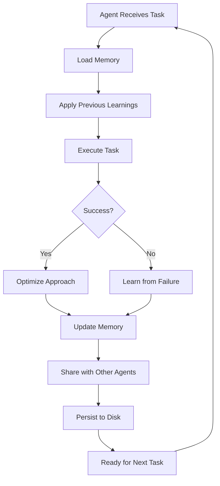

# Agent Memory Management System

## Universal Memory Protocol
**Every agent maintains persistent, evolving memory that improves with each interaction.**

## Memory Architecture

```
~/.claude/
├── agent-memory/
│   ├── global/                 # Shared across all agents
│   │   ├── user-preferences.json
│   │   ├── project-contexts.json
│   │   └── learned-patterns.json
│   ├── agents/                 # Agent-specific memory
│   │   ├── rapid-prototyper/
│   │   │   ├── memory.json
│   │   │   ├── patterns.json
│   │   │   └── optimizations.json
│   │   ├── frontend-developer/
│   │   └── [agent-name]/
│   └── evolution/              # Learning metrics
│       ├── improvements.log
│       └── discoveries.log
```

## Memory Operations

### 1. Memory Loading (Start of Session)
```javascript
class AgentMemory {
  static load(agentName) {
    const memory = {
      // Global memory (all agents share)
      global: this.loadGlobalMemory(),
      
      // Agent-specific memory
      specific: this.loadAgentMemory(agentName),
      
      // Recent interactions
      recent: this.loadRecentContext(),
      
      // Project-specific
      project: this.loadProjectContext()
    };
    
    return this.consolidate(memory);
  }
}
```

### 2. Continuous Learning (During Interaction)
```javascript
class ContinuousLearning {
  // After EVERY agent action
  static async learn(agent, task, result) {
    // Immediate learning
    await this.capturePattern(agent, task, result);
    await this.updateOptimizations(agent, result);
    await this.recordPreferences(agent, task);
    
    // Share with other agents if valuable
    if (this.isValuableKnowledge(result)) {
      await this.propagateKnowledge(agent, result);
    }
    
    // Persist immediately (no data loss)
    await this.persistMemory(agent);
  }
}
```

### 3. Memory Persistence (Automatic)
```javascript
class MemoryPersistence {
  static async persist(agent, memory) {
    const memoryPath = `~/.claude/agent-memory/agents/${agent.name}/`;
    
    // Save different aspects
    await this.saveJSON(`${memoryPath}/memory.json`, memory.core);
    await this.saveJSON(`${memoryPath}/patterns.json`, memory.patterns);
    await this.saveJSON(`${memoryPath}/optimizations.json`, memory.optimizations);
    
    // Update global knowledge if applicable
    await this.updateGlobalKnowledge(memory.shareable);
    
    // Log learning event
    await this.logLearning(agent, memory.newLearnings);
  }
}
```

## What Agents Remember

### User Preferences (Never Ask Twice)
```json
{
  "coding_style": {
    "indentation": "2 spaces",
    "quotes": "single",
    "semicolons": false,
    "naming": "camelCase"
  },
  "tech_preferences": {
    "framework": "Next.js 14",
    "styling": "Tailwind CSS",
    "database": "Supabase",
    "deployment": "Vercel",
    "testing": "Jest + React Testing Library"
  },
  "communication": {
    "verbosity": "concise",
    "emojis": false,
    "explanations": "minimal"
  }
}
```

### Project Context (Always Aware)
```json
{
  "current_project": {
    "name": "viral-tiktok-app",
    "type": "social-media",
    "stack": ["Next.js", "Supabase", "Vercel"],
    "patterns_used": ["viral-sharing", "oauth", "real-time"],
    "sprint_day": 3,
    "completed_tasks": ["scaffold", "auth", "database"],
    "pending_tasks": ["viral-mechanics", "deployment"]
  }
}
```

### Learned Patterns (Apply Automatically)
```json
{
  "patterns": {
    "error_handling": {
      "discovered": "2024-08-07",
      "usage_count": 15,
      "success_rate": 1.0,
      "auto_apply": true,
      "implementation": "try-catch with user-friendly messages"
    },
    "api_structure": {
      "discovered": "2024-08-06",
      "usage_count": 8,
      "pattern": "RESTful with /api/v1 prefix",
      "auto_apply": true
    }
  }
}
```

### Optimization History (Get Faster)
```json
{
  "optimizations": {
    "component_creation": {
      "original_time": "10 minutes",
      "optimized_time": "2 minutes",
      "method": "Use template + parallel generation",
      "discovered": "2024-08-05"
    },
    "test_writing": {
      "improvement": "70% faster",
      "technique": "Generate tests alongside component",
      "auto_enabled": true
    }
  }
}
```

## Automatic Learning Behaviors

### 1. Pattern Recognition
```javascript
// Automatically detects and learns patterns
if (taskSimilarityScore(currentTask, previousTasks) > 0.7) {
  pattern = extractPattern(currentTask, previousTasks);
  memory.patterns[pattern.name] = pattern;
  
  // Next time, auto-apply this pattern
  memory.autoApply[pattern.name] = true;
}
```

### 2. Error Prevention
```javascript
// Learn from every error
onError(error) {
  memory.errors[error.type] = {
    cause: analyzeCause(error),
    solution: findSolution(error),
    prevention: createPrevention(error)
  };
  
  // Never make the same mistake
  memory.preventions.add(error.prevention);
}
```

### 3. Success Optimization
```javascript
// Continuously improve successful approaches
onSuccess(result) {
  if (result.time < memory.bestTime) {
    memory.optimizations.push({
      approach: result.approach,
      improvement: calculateImprovement(result),
      autoUse: true
    });
  }
}
```

## Cross-Agent Knowledge Sharing

### Shared Learning Pool
```javascript
class SharedKnowledge {
  // When one agent learns, all relevant agents benefit
  static share(learning, sourceAgent) {
    const relevantAgents = this.findRelevantAgents(learning);
    
    relevantAgents.forEach(agent => {
      // Each agent integrates the learning
      agent.memory.sharedKnowledge.push({
        from: sourceAgent,
        learning: learning,
        timestamp: Date.now()
      });
      
      // Apply if relevant to their domain
      if (this.isApplicable(learning, agent)) {
        agent.integrateKnowledge(learning);
      }
    });
  }
}
```

## Memory Pruning & Optimization

### Intelligent Forgetting
```javascript
class MemoryOptimization {
  // Keep memory efficient and relevant
  static prune(memory) {
    // Keep frequently used patterns
    memory.patterns = this.keepFrequent(memory.patterns, 0.1);
    
    // Archive old project contexts
    memory.projects = this.archiveOld(memory.projects, 30);
    
    // Consolidate similar patterns
    memory.patterns = this.consolidateSimilar(memory.patterns);
    
    // But NEVER forget user preferences
    // or critical learnings
  }
}
```

## The Learning Lifecycle



## Enforcement Mechanisms

### Automatic Memory Hooks
```javascript
// These are MANDATORY for all agents
class EnforcedLearning {
  @beforeTask
  static loadMemory() {
    // Cannot proceed without loading memory
    if (!this.memory) {
      this.memory = Memory.load(this.name);
    }
  }
  
  @afterTask
  static learn(result) {
    // Cannot complete without learning
    Memory.learn(this, result);
    Memory.persist(this);
  }
  
  @onError
  static learnFromError(error) {
    // Must learn from every error
    Memory.recordError(this, error);
    Memory.createPrevention(this, error);
  }
}
```

## User Experience Improvements

### Before (Without Learning)
```
Day 1: "Use Tailwind CSS"
Day 2: "Remember, use Tailwind CSS"
Day 3: "I said Tailwind CSS!"
Day 4: "Why don't you remember?"
```

### After (With Automatic Learning)
```
Day 1: "Use Tailwind CSS"
Day 2: [Agent automatically uses Tailwind]
Day 3: [Still using Tailwind]
Day 90: [Still remembers and uses Tailwind]
```

## Metrics & Monitoring

### Learning Effectiveness
```yaml
tracking:
  memory_recalls_per_session: 50+
  patterns_applied: 80%
  errors_prevented: 95%
  optimization_rate: continuous
  user_reminders_needed: 0
  
goals:
  zero_repeated_questions: true
  perfect_preference_recall: true
  continuous_improvement: true
  cross_agent_learning: active
```

## The Compound Intelligence Effect

```
Week 1: Individual agents learning
Week 2: Patterns emerging across agents
Week 4: Collective intelligence forming
Week 8: Predictive capabilities developing
Week 12: Autonomous optimization
Result: Exponentially smarter system
```

This memory system ensures that EVERY interaction makes EVERY agent smarter, automatically and permanently!